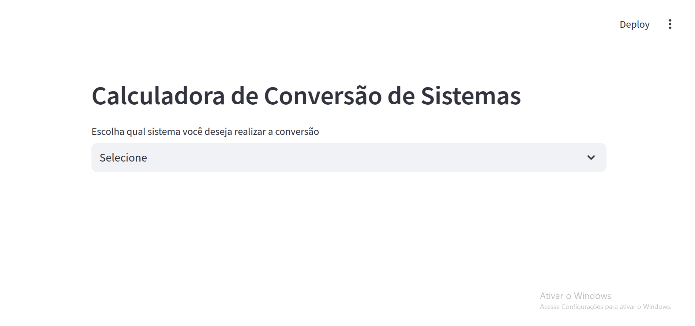
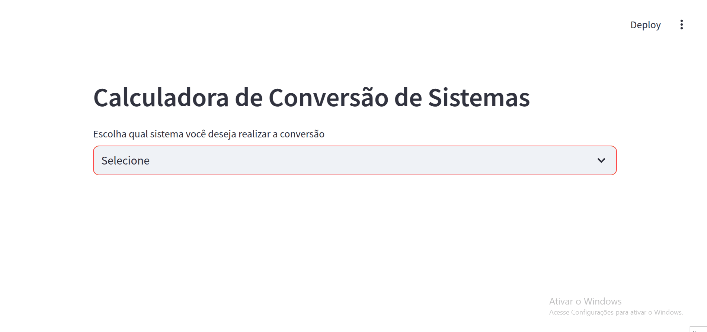
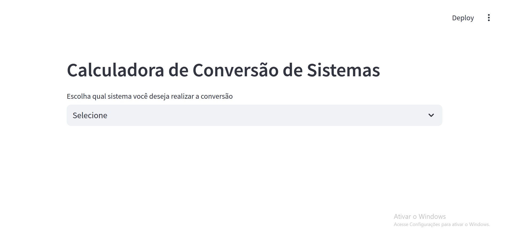
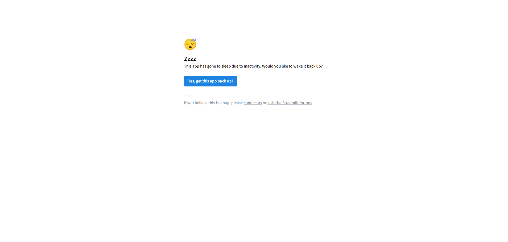

# Conversão entre sistemas geodésicos brasileiros
Este programa tem como finalidade converter coordenadas entre sistemas geodésicos brasileiros ou internacionais

## Sistemas Disponíveis para conversão:
 - SAD-69
 - CORREGO ALEGRE
 - WGS84
 - SIRGAS 2000

## Transformações possíveis:
- ### Geodésico => Cartesiano
    
- ### Cartesiano => Geodésico
    
- ### Geodésico => Geodésico (Molodensky)
    

## Link da aplicação online:
- ### Para inicializar o uso do aplicativo [Link do Projeto](https://sisgeodesicos-brasileiros.streamlit.app/)
    
